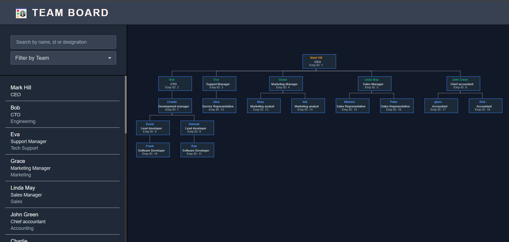
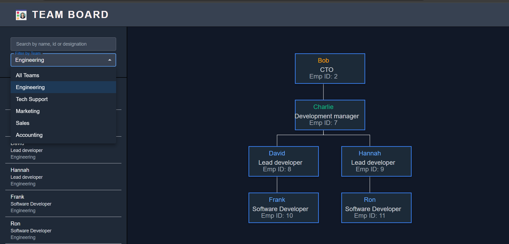
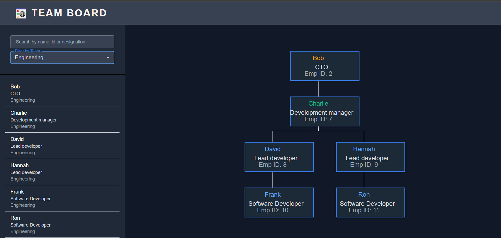

# Team Board

A React + TypeScript project that displays a hierarchical organizational chart of employees using `react-d3-tree`. It includes features like drag-and-drop reparenting of employees, team-based filtering, search, and responsive UI design.

## Features

-  **Dynamic Tree Visualization** using `react-d3-tree`
-  **Search and Filter** employees by name, ID, designation, or team
-  **Drag and Drop** employees to reassign their managers
-  **Mock API** using MirageJS to simulate backend behavior
-  **Responsive Layout** with adaptive grid structure

## Tech Stack

-  React (with Vite + TypeScript)
-  TailwindCSS
-  Redux Toolkit (for state management)
-  react-d3-tree
-  MirageJS (mock backend)

## Getting Started

### Clone the repo

```bash
git clone https://github.com/nikhilkuruba/team-board.git
cd team-board
```

### Install Dependencies

```bash
npm install
```

### Start development server

```bash
npm run dev
```
The app should be live at:
http://localhost:5173

### Run Unit Tests with [Vitest](https://vitest.dev/)

```bash
npm run test
```

### Run Unit Tests under watch
```bash
npx vitest --watch
```

### Type-Check, Compile and Minify for Production

```bash
npm run build
```

### Locally preview the production build
```bash
npm run preview
```

### Usage

1. Drag an employee node onto another manager to change its reporting hierarchy.

2. Use the team dropdown to filter employees by team.

3. Use the search bar to filter by name, ID, or designation.

4. If an invalid drop happens (outside any node), the dragged node returns to its original position.

### Screenshots



